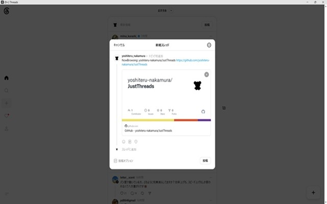
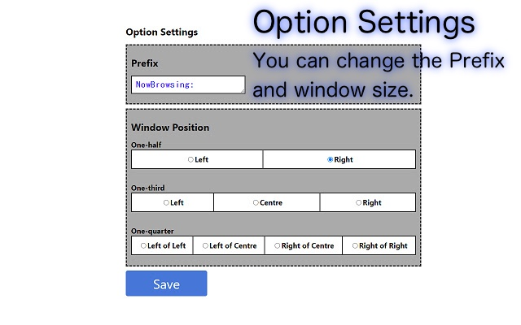
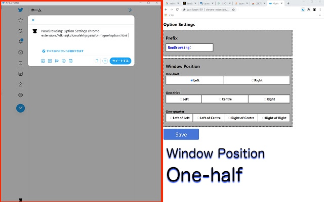
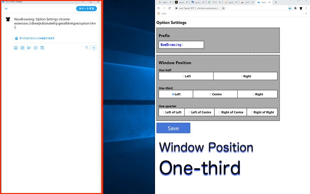
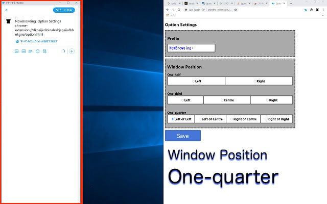

# Just Threads

[Chrome ウェブストアのページに移動](hhttps://chromewebstore.google.com/detail/just-threads/gbmjdlnjifplplhgkempnchhipgajnkc)

+ 現在閲覧しているページのURLとタイトルをThreadsに連携するChrome機能拡張です。  
本プログラムのソースコードは、以下のGitHubリポジトリで公開しています。  
 [https://github.com/yoshiteru-nakamura/JustThreads](https://github.com/yoshiteru-nakamura/JustThreads)

---

+ This is an extension that links the URL and title of the page you are currently viewing to Threads.  
The source code of this program is available on the following GitHub repository.  
 [https://github.com/yoshiteru-nakamura/Justhreads](https://github.com/yoshiteru-nakamura/JustThreads)

---

---
