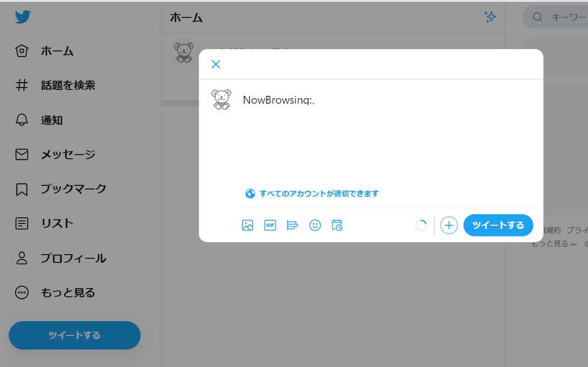

# Just Tweetボタン改
[Chrome ウェブストアのページに移動](https://chrome.google.com/webstore/detail/just-tweet-button-mod/ldlnplkhnncjkancombeidklmdpfpgkn)

+ 現在閲覧しているページのURLとタイトルをTwitterに連携する機能拡張です。

+ 最近のChromeでは「
[Tweet: Now Browsing!](https://chrome.google.com/webstore/detail/tweet-now-browsing/glepgipoohhiadcmcaajmkfniihojnea)」
が使えなくなってしまいましたが、
「
[Just Tweet Button](https://chrome.google.com/webstore/detail/just-tweet-button/feikojefkpembojkeegfajbbfecocddd)
」を元に同様のツイートが出来るようにしました。

+ 本機能拡張は「
[Just Tweet Button](https://github.com/koron/JustTweet)
」を改変したものです。オリジナル作者の方に感謝します。

+ 本プログラムのソースコードは、以下のGitHubリポジトリで公開しています。

 [https://github.com/yoshiteru-nakamura/JustTweet](https://github.com/yoshiteru-nakamura/JustTweet)

---

# Just Tweet Button mod
+ This is an extension that links the URL and title of the page you are currently viewing to Twitter.

+ "
[Tweet: Now Browsing!](https://chrome.google.com/webstore/detail/tweet-now-browsing/glepgipoohhiadcmcaajmkfniihojnea)
" Can no longer be used, but the same tweet can be made based on "
[Just Tweet Button](https://chrome.google.com/webstore/detail/just-tweet-button/feikojefkpembojkeegfajbbfecocddd)
".

+ This extension is a modification of "
[Just Tweet Button](https://github.com/koron/JustTweet)
". Thank you to the original author.

+ The source code of this program is available on the following GitHub repository.

 [https://github.com/yoshiteru-nakamura/JustTweet](https://github.com/yoshiteru-nakamura/JustTweet)